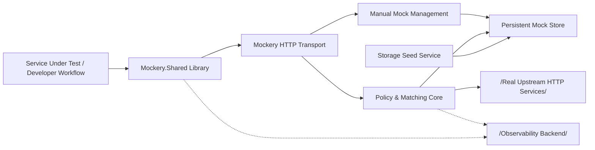
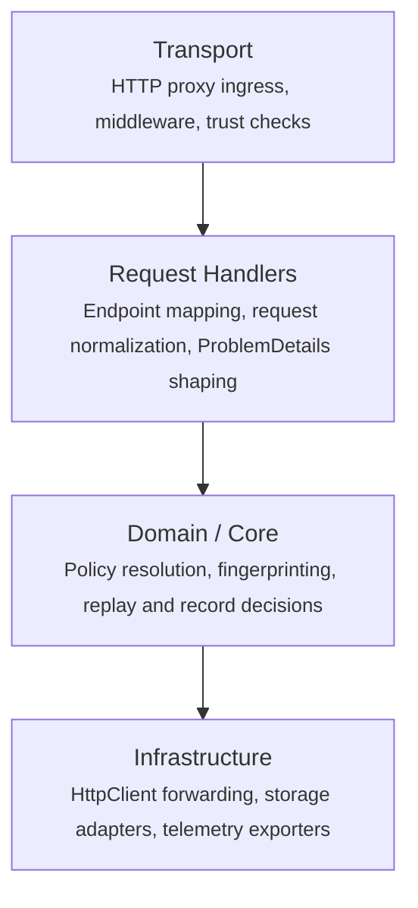
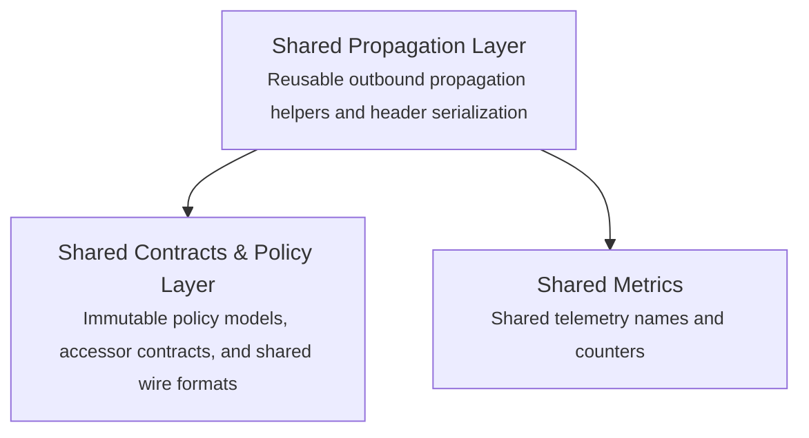
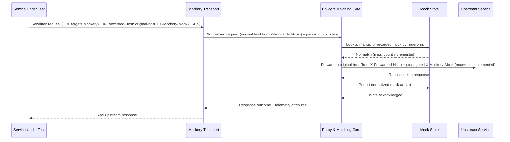
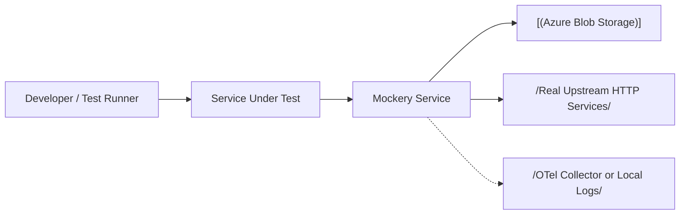

<!-- SPARK -->

# Architecture — Mockery

> **Version**: 2.6 
> **Created**: 2026-04-13 
> **Last Updated**: 2026-04-22 
> **Owner**: Dave Harding 
> **Namespace**: Test 
> **Project**: Mockery 
> **Project Type**: dotnet-webapi 
> **Status**: Approved
> **Type**: ARCHITECTURE

---

> Mockery is a development-time HTTP reverse proxy for service teams working on local workstations and cloud-hosted development sandboxes. It intercepts outbound HTTP calls, replays stored responses when request fingerprints match, and forwards or records real upstream traffic when mocking is enabled for the current request. A companion shared library (Mockery.Shared) packages host-neutral contracts, immutable policy and model types, and reusable propagation components that consuming services reference to participate in the mocking system and that the Mockery proxy may also reference when sharing removes duplicated client and service logic without collapsing service boundaries. The architecture builds on a lightweight API host, dependency-injected service boundaries, and a composition-oriented test and app-host foundation.

---

## Architecture Principles

1. **Transparent interception over curated onboarding** — Mockery must behave like a true proxy for standard HTTP dependencies so new upstreams work without per-destination registration in the common case.
2. **Correctness beats hit rate** — replay is only valid when request target and materially relevant request shape align, even when stricter matching produces more misses and more recording.
3. **Environment-scoped, inspectable state** — persisted mocks are stored as human-readable artifacts in environment-appropriate persistent storage and isolated per environment so developers can review, edit, and govern recorded data without hidden storage behavior.
4. **Template-aligned boundaries** — transport stays in Minimal API endpoints and middleware, core rules stay HTTP-agnostic services, and infrastructure owns network and storage adapters so the target system fits the repository's service template.

---

## System Overview

Mockery comprises two closely related .NET projects: the **Mockery proxy service** (an ASP.NET Core application) and the **Mockery.Shared** class library. The proxy service acts as a reverse proxy that sits between a service under test and real upstream HTTP dependencies, while Mockery.Shared packages only host-neutral contracts, immutable policy types, header and serialization helpers, and reusable propagation components that services under test use to participate in the mocking system and that the proxy may also reuse to avoid duplicating shared logic. Proxy-only transport, trust validation of forwarding metadata, request fingerprinting, replay matching, persistence orchestration, manual mock CRUD endpoints, and storage schema concerns remain in Mockery. Beyond the catch-all proxy route, the service exposes a dedicated `/_mockery/mocks` REST surface for creating, reading, updating, and deleting manual mock artifacts. Persistent storage keeps manual and recorded mocks available across local and sandbox sessions, a startup seed service can pre-populate the store from on-disk JSON files, and observability components track replay hits, misses, passthrough, and capture failures via custom OpenTelemetry metrics.

### Component Map

| Component | Responsibility | Technology |
|---|---|---|
| Mockery HTTP transport boundary | Accepts reverse-proxied outbound requests, reads the `X-Forwarded-Host` header to resolve the original upstream hostname, extracts the `X-Mockery-Mock` header and parses its JSON value to determine mock scope, host exclusions, and propagation depth (`maxHops`), validates boundary data, and maps failures to HTTP responses | C#, ASP.NET Core 10 Minimal APIs, ASP.NET Core middleware |
| Policy resolution and matching core (`PolicyResolutionService`, `ProxyRequestService`, `RequestFingerprintComputer`, `RequestFingerprintCanonicalizer`) | Resolves the `X-Mockery-Mock` header into a `MockPolicy`; computes the effective exclusion set as the union of config-level `Mockery:Capture:ExcludedHosts` and per-request `excludeHosts`, with config exclusions always enforced and never removable by a request; orchestrates the replay-or-forward decision for each proxied request (`ProxyRequestService` via `IProxyRequestService`); canonicalizes the material request shape into a deterministic fingerprint string using the original authority from `X-Forwarded-Host`, normalized path and query, configured relevant headers after case-insensitive name normalization and stable ordering, and a bounded body hash while excluding transport and control headers, then computes a SHA-256 digest (`RequestFingerprintCanonicalizer` + `RequestFingerprintComputer`) | C#, .NET 10 dependency injection, immutable `record` types, SHA-256 |
| Outbound forwarding adapter | Sends real HTTP calls to the upstream service identified by `X-Forwarded-Host`, propagates policy and tracing context by re-serializing the `X-Mockery-Mock` JSON value only when `maxHops` is greater than `0`, and emits a decremented `maxHops` value on each downstream hop until propagation stops | Typed `HttpClient`, `DelegatingHandler`, HTTP/1.1 and HTTP/2 |
| Persistent mock store (`BlobMockStore`, `AzureBlobMockContainerClient`) | Reads and writes human-readable manual and recorded mock artifacts as JSON blobs in Azure Blob Storage behind an `IMockStore` / `IManualMockStore` interface; serves replay lookups for every mock-enabled, non-excluded proxied request; and emits `mockery.mock.hit_count` and `mockery.mock.miss_count` OTel counters from the proxy perspective. Manual mocks are dual-written: a `StoredMockArtifact` at `{host}_{port}/{METHOD}/{hash}.json` for replay lookup and a `ManualMockArtifact` at `manual-index/{id}.json` for CRUD by ID. Recorded misses persist their replay artifact before the proxy returns success to the caller. Manual mock create, update, and delete operations are acknowledged only after both the replay-addressed blob and the CRUD-by-ID blob mutations complete; partial dual-write or dual-delete failures are surfaced as operation failures rather than reported as success. Replay lookups include a legacy fallback that checks `recorded/{hash}.json` and then scans `manual/{id}.json` blobs when the current-path lookup misses. Persisted blobs carry a `schemaVersion` field (`StoredMockArtifact.CurrentSchemaVersion = 1`); deserialization rejects blobs with unsupported versions | Azure Blob Storage (Azurite emulator locally, Azure Storage in cloud), JSON serialization, OpenTelemetry Metrics API |
| Manual mock management (`ManualMockHandler`, `MockValidator`, `MockArtifactDocumentReader`) | Exposes `/_mockery/mocks` REST endpoints (GET list, GET by ID, POST create, PUT update, DELETE) for CRUD operations on manual mock artifacts; validates mock shape, computes fingerprints on create/update, detects fingerprint-change conflicts, and treats read-only storage mode as a write conflict for POST, PUT, and DELETE rather than a storage outage | C#, ASP.NET Core 10 Minimal APIs, `IManualMockStore` |
| Mock storage seed service (`MockStorageSeedHostedService`) | On startup, reads mock artifact JSON files from a configured seed directory, clears the blob container, and pre-populates it so integration tests and development sessions begin with a known mock baseline | `IHostedService`, JSON file I/O, `IManualMockStore` |
| Mockery.Shared shared contracts and propagation library | Packages host-neutral contracts, immutable policy models, header and serialization helpers, and reusable propagation components that consuming services use directly and that the proxy may reuse selectively when sharing avoids duplicated client or service logic | .NET 10 class library |
| Verification harness | Exercises matching, persistence, and end-to-end proxy flows in process and during integration testing | xUnit, `WebApplicationFactory` |

---

## Layers & Boundaries

The system is organized into a proxy service plus an adjacent shared library with distinct layering:

**Mockery proxy service** follows the repository's layered Minimal API service template, expanded into explicit proxy transport, handler orchestration, core policy and matching, and infrastructure adapters.

**Mockery.Shared** is a standalone .NET class library with no dependency on the proxy service. It provides host-neutral shared types that consuming services reference, and that the proxy may also reference when the types represent reusable contracts or propagation behavior rather than proxy-only implementation details:

**Dependency rules — these are hard constraints, not guidelines:**

- Dependencies flow downward only: Transport → Handlers → Core → Infrastructure.
- Core must not reference Infrastructure directly — it defines interfaces for mock storage, outbound forwarding, hashing, and clocks that Infrastructure implements.
- Endpoint modules and middleware must not contain matching, persistence, or replay business rules — they only normalize HTTP input, create policy context, and map service results to HTTP responses.
- Infrastructure implementations must not import from Transport or Handlers — no `HttpContext`, `IResult`, or route types outside the boundary layer.
- **The Mockery proxy service may depend on Mockery.Shared only for host-neutral shared contracts, immutable models, header or serialization helpers, and reusable outbound propagation components that remove duplicated client or service logic.**
- **Mockery.Shared must not depend on the proxy service, ASP.NET Core hosting or middleware, proxy orchestration, proxy-only matching or persistence policies, manual mock CRUD handlers, or provider-specific storage or network adapters — it remains a host-neutral shared library.**
- **Proxy-only transport, forwarding-metadata trust checks, orchestration, fingerprint normalization, matching, persistence, manual CRUD endpoint behavior, and other operational types belong in Mockery, not Mockery.Shared.**
- Request-scoped mock policy must be carried as an immutable context object and propagated via trace or header metadata across outbound calls; it must not rely on mutable static state or process-wide toggles.
- All async boundaries must accept and propagate `CancellationToken`; long-running proxy, storage, and outbound calls must honor cancellation rather than swallow it.

---

## Key Architectural Decisions

- **Keep Mockery as a single ASP.NET Core Minimal API service** — this preserves the repository's service template and keeps local and sandbox hosting simple, while ruling out a separate control-plane or sidecar fleet for v1. → [ADR-0001](./adr/ADR-0001-single-minimal-api-proxy-service.md)
- **Use true-proxy forwarding as the default integration model** — this removes per-upstream onboarding work and rules out a curated stub catalog as the primary developer path. → [ADR-0002](./adr/ADR-0002-true-proxy-forwarding-default.md)
- **Match replays using request target plus materially relevant request shape** — this favors replay correctness over broad reuse and rules out loose host-or-path-only matching by default. → [ADR-0003](./adr/ADR-0003-request-target-and-shape-matching.md)
- **Propagate request-scoped mock policy across downstream HTTP hops** — this enables mixed replay and passthrough behavior inside one trace and rules out isolated per-process toggles; propagation depth is controlled by the `maxHops` field in the `X-Mockery-Mock` JSON value. → [ADR-0004](./adr/ADR-0004-propagated-request-scoped-mock-policy.md)
- **Simplify per-request mock control to a single `X-Mockery-Mock` header with a JSON value** — this replaces the original multi-header scheme with one header whose JSON value carries mock activation, host exclusions (`excludeHosts`), and propagation depth (`maxHops`), reducing client complexity and eliminating the need for a separate propagation header. → [ADR-0006](./adr/ADR-0006-single-mock-header.md)
- **Control multi-hop propagation depth via `maxHops` in the `X-Mockery-Mock` JSON value** — this replaces the implicit always-propagate model with explicit depth control embedded in the single mock header, letting callers limit how far downstream mock policy travels without a separate header. → [ADR-0008](./adr/ADR-0008-controlled-propagation-depth-via-max-hops.md)
- **Persist mocks behind a human-readable storage abstraction** — this keeps artifacts inspectable across workstation and sandbox environments while ruling out opaque, environment-coupled persistence. → [ADR-0005](./adr/ADR-0005-human-readable-storage-abstraction.md)
- **Use Azure Blob Storage as the persistence backend for mock artifacts** — this provides a consistent storage API across local (Azurite) and cloud (Azure Storage) environments, replacing direct filesystem storage while keeping blobs human-readable. → [ADR-0007](./adr/ADR-0007-azure-blob-storage-persistence-backend.md)
- **Keep request fingerprint canonicalization in Mockery.Core.Matching** — this centralizes all normalization rules (method, destination, path, query, relevant headers, body hashing) in one Core-owned boundary so replay, recording, and manual-mock authoring stay consistent and proxy-only matching logic does not leak into Mockery.Shared. → [ADR-0009](./adr/ADR-0009-use-core-owned-request-fingerprint-canonicalization.md)
- **Keep outbound forwarding behind `IUpstreamForwarder`** — this preserves fast, deterministic orchestration tests and clean Core-to-Infrastructure boundaries, while ruling out embedding raw `HttpClient` transport logic directly in `ProxyRequestService`. → [ADR-0010](./adr/ADR-0010-upstream-forwarder-implementation-boundary.md)
- **Use dual-write blob persistence for manual mock CRUD and replay lookup** — this keeps manual authoring and replay on one blob-backed persistence path and rules out a separate manual-only lookup model, while accepting eventual consistency across the paired blob writes. → [ADR-0011](./adr/ADR-0011-dual-write-blob-persistence-manual-replay.md)
- **Map the catch-all proxy route after explicit routes** — this preserves OpenAPI and future operational endpoints on the shared Minimal API host and rules out registering the `/{**path}` proxy handler before explicit route surfaces. → [ADR-0012](./adr/ADR-0012-catch-all-route-ordering-explicit-routes.md)

---

## Primary Data Flow

The dominant flow is a mock-enabled outbound HTTP call that misses the store, records the real upstream interaction, and makes that interaction replayable for later matching.

**Happy path: mock-enabled outbound call with record-on-miss**

1. A service under test makes an outbound HTTP call. The Mockery.Shared `MockPolicyPropagationHandler` intercepts the request, rewrites the URL to target the Mockery proxy's address, sets the `X-Forwarded-Host` header to the original upstream hostname (for example, `api.example.com`), and attaches the `X-Mockery-Mock` header with the current mock policy.
2. The Mockery HTTP transport boundary accepts the request, reads `X-Forwarded-Host` to resolve the original upstream target, extracts the `X-Mockery-Mock` header, and parses its JSON value into a request-scoped policy context. The effective exclusion set is the union of global `Mockery:Capture:ExcludedHosts` and per-request `excludeHosts`; global exclusions always remain in force. If `maxHops` is omitted, Mockery interprets it as `0`, meaning the current service still applies mocking locally but does not propagate mock policy further downstream.
3. If the resolved upstream host is in the effective exclusion set, the request takes an explicit passthrough path: Mockery skips replay lookup and recording for that host and forwards the request to the real upstream.
4. Otherwise, core policy services normalize the material request shape into a deterministic fingerprint using the original authority from `X-Forwarded-Host`, normalized path and query, configured relevant headers, and a bounded body hash. Transport and control headers such as `X-Mockery-Mock`, `X-Forwarded-Host`, and trace-propagation headers are not part of the fingerprint.
5. The mock storage adapter looks for a manual or recorded mock matching that fingerprint within the active environment store. For mock-enabled, non-excluded requests, this read is required even when Mockery is configured read-only.
6. If a matching mock exists, the core returns the stored response and the transport boundary writes it back to the caller as a replay hit.
7. If no eligible mock exists and storage is writable, the outbound forwarding adapter reconstructs the request URL using the original host from `X-Forwarded-Host` and sends the real request to the upstream service. It propagates the mock header only when the inbound policy's `maxHops` is greater than `0`, re-serializing the JSON with `maxHops - 1` for the downstream hop.
8. When the upstream returns successfully and recording is active, the core normalizes the interaction into a human-readable artifact and persists it through the storage abstraction before completing the response.
9. The transport boundary returns the upstream response to the caller and emits hit, miss, passthrough, and recording telemetry so later flows can replay or diagnose the interaction.

**Key error paths:**

- **Missing `X-Forwarded-Host` header**: the transport boundary cannot determine the original upstream target, returns `400 ProblemDetails` with error code `MISSING_FORWARDED_HOST`, and logs the rejection.
- **Invalid or contradictory mock policy metadata**: the transport boundary rejects the request before forwarding, returns `400 ProblemDetails`, and logs which policy field failed validation.
- **Replay miss plus upstream timeout or unreachable host**: the outbound forwarding adapter surfaces the network failure, the boundary returns `502` or `504` without persisting a mock, and telemetry records a miss with upstream failure.
- **Mock store unavailable while a required store read or write is in scope**: the storage adapter fails fast, the core refuses to silently bypass deterministic replay and record behavior, and the boundary returns `503 ProblemDetails` until storage recovers. This includes replay lookup for mock-enabled, non-excluded proxy requests and all manual mock CRUD operations.
- **Request body exceeds `MaxBodyBytes`**: the transport boundary rejects the request with `413 ProblemDetails` before fingerprinting or forwarding.
- **Recording or manual mutation attempted while store is configured read-only**: read-only mode still permits replay hits and read-only manual mock inspection (`GET` / list), but it does not permit record-on-miss or manual `POST` / `PUT` / `DELETE`. Those write-requiring operations fail with `409 ProblemDetails` because the conflict is with configured storage mutability, not storage availability.

**Secondary flow: manual mock CRUD via `/_mockery/mocks`**

Developers or automation interact with the manual mock management endpoints to create, inspect, update, or delete mock artifacts independently of the proxy flow.

1. A client sends a REST request to one of the `/_mockery/mocks` endpoints (e.g., `POST /_mockery/mocks` with a `ManualMockArtifact` JSON body).
2. `ManualMockEndpoints` delegates to `IManualMockHandler` (`ManualMockHandler`), which validates the artifact via `MockValidator`.
3. On create or update, the handler computes a request fingerprint from the mock's request shape using `IRequestFingerprintComputer` and persists the artifact through `IManualMockStore` (`BlobMockStore`) as one logical dual-write operation: the replay-addressed blob used by runtime lookup and the ID-addressed blob used by CRUD operations. On update, a fingerprint-changing mutation removes the old replay blob before success is acknowledged; if storage is configured read-only, the mutation fails with `409`, and if storage is unavailable, the operation fails with `503`.
4. The endpoint returns the created or updated artifact (or a list / deletion confirmation) as a JSON response only after the required storage mutations complete. Delete follows the same rule and removes both representations before reporting success.

---

## External Dependencies

| Dependency | Purpose | Required? | Failure behavior |
|---|---|---|---|
| Upstream HTTP services | Source of real responses for replay misses and explicit passthrough destinations | Optional | Replay hits continue from stored mocks; replay misses or passthrough calls return `502` or `504` when the upstream is unreachable and no new recording is written |
| Azure Blob Storage (Azurite locally, Azure Storage in cloud) | Loads manual and recorded mocks and persists new artifacts as JSON blobs between sessions; Azurite is provisioned manually or via local development tooling | Yes | Mock-enabled, non-excluded requests fail with `503` when required lookup or write operations cannot complete because deterministic replay and record behavior cannot be guaranteed; read-only mode is different and yields `409` only for write-requiring operations |
| Development routing or orchestrator | Mockery.Shared `MockPolicyPropagationHandler` rewrites outbound HTTP request URLs to target the Mockery proxy and sets `X-Forwarded-Host` with the original upstream hostname; alternatively, environment-level proxy configuration can direct traffic to Mockery | Optional | If routing is not configured, calls bypass Mockery entirely and no record-and-replay behavior occurs for those requests |
| OpenTelemetry collector or metrics sink | Exports logs, metrics, and traces from proxy flows to local or sandbox diagnostics tooling | Optional | Proxy execution continues with local logging only; telemetry export failures are logged but do not block requests |

---

## Configuration Reference

These keys describe the target-state runtime surface; the current scaffold exposes only standard ASP.NET Core settings until Mockery behavior is implemented.

| Key | Default | Purpose |
|---|---|---|
| `ASPNETCORE_URLS` | `http://0.0.0.0:5226` | HTTP listen address for proxy ingress in local and containerized runs |
| `Mockery:Storage:ContainerName` | `mocks` | Azure Blob Storage container name where human-readable mock artifacts are stored |
| `Mockery:Storage:ReadOnly` | `false` | Allows reads from the existing store, including replay hits and read-only manual mock inspection, while rejecting any mutation that would write or delete stored artifacts; write-requiring operations return `409`, while store unavailability remains a `503` condition |
| `Mockery:Policy:MockHeader` | `X-Mockery-Mock` | Header that controls mock activation; value is a JSON object `{"maxHops": N, "excludeHosts": [...]}`. Presence activates mocking, `excludeHosts` defaults to `[]`, and `maxHops` defaults to `0` when omitted. Omitted or `0` means "mock locally only, do not propagate downstream." Propagation occurs only when `maxHops` is greater than `0`, and each downstream hop decrements the forwarded value by `1` |
| `Mockery:Policy:ForwardedHostHeader` | `X-Forwarded-Host` | Standard header set by the Mockery.Shared handler to carry the original upstream hostname; the proxy reads this to resolve the real upstream target for forwarding and to include the original host in request fingerprints — requests missing this header are rejected with `400` |
| `Mockery:Capture:ExcludedHosts` | empty | Comma-separated host patterns that must never be captured and must always passthrough; merged with per-request `excludeHosts` as a union, with config exclusions taking precedence because request headers cannot remove them; supports leading-wildcard patterns (for example, `*.example.com`) |
| `Mockery:Matching:RelevantHeaders` | `Content-Type,Accept` | Additional headers included in request-shape fingerprinting beyond method, authority, path, query, and normalized body. Matching is case-insensitive on header names and uses a stable normalized representation; transport, control, and trace-propagation headers are excluded from fingerprinting |
| `Mockery:Matching:MaxBodyBytes` | `262144` | Maximum body size considered for fingerprinting and persisted mock normalization |
| `Mockery:Tracing:EnableOpenTelemetry` | `true` | Enables OTLP metrics and traces plus downstream request-context propagation |
| `Mockery:Seed:Path` | empty | Absolute path to a directory of mock artifact JSON files; when set, the `MockStorageSeedHostedService` clears the blob container at startup and loads every `*.json` file from this directory to pre-populate the store — injected via environment configuration |

> **Note:** The Azure Blob Storage connection string is not configured via an application setting. It is resolved automatically through .NET dependency injection.

Config is loaded in this order (later entries win):
1. `appsettings.json` — committed defaults
2. `appsettings.Development.json` and other environment-specific override files — environment overrides
3. Environment variables — runtime overrides

---

## Security & Trust Boundary

- **Caller trust model**: Only service processes, tests, and developer tooling inside a local workstation or cloud-dev sandbox should reach Mockery; exposure is limited to local or internal sandbox routing rather than public internet ingress.
- **Write / destructive operations**: Recording a real interaction creates or overwrites the specific mock artifact for that fingerprint, and manual mock maintenance happens through explicit file edits or dedicated maintenance endpoints inside the same dev boundary; ordinary replay requests never delete stored mocks automatically.
- **Sensitive data handled**: Request and response headers, bodies, cookies, and bearer tokens can transit the proxy; HTTPS to upstreams is preserved, sensitive hosts can be excluded from capture, and persisted artifacts remain environment-scoped and human-readable for review.
- **Protected resources**: Mock store contents, passthrough exclusions, and upstream credentials forwarded by the service under test must not be modified by unrelated requests or by any public caller.
- **Audit trail**: Structured logs and traces record activation mode, fingerprint outcome (hit, miss, passthrough), destination host, storage write attempts, and failure reasons using request and trace identifiers.

---

## Observability

- **Logging**: Structured JSON via `ILogger` and OpenTelemetry console or OTLP exporters. `Information` covers hit, miss, passthrough, effective exclusion resolution, recording decisions, maxHops propagation, and `X-Forwarded-Host` resolution; `Warning` covers malformed mocks, excluded-capture attempts, missing `X-Forwarded-Host`, invalid `X-Mockery-Mock` JSON values, and read-only write conflicts; `Error` covers upstream and storage failures.
- **Metrics**: Custom OpenTelemetry counters emitted from the Mockery proxy service's `BlobMockStore` (meter name: `Mockery.Storage`):
  - `mockery.mock.hit_count` — incremented when a request fingerprint matches a stored mock and a replay is served
  - `mockery.mock.miss_count` — incremented when a request fingerprint does not match any stored mock
  - Additional counters for passthroughs, recordings, and store read/write failures, plus histograms for upstream and storage latency, are planned for local or sandbox collectors. Mockery.Shared does not currently emit its own metrics.
- **Tracing**: W3C trace context plus baggage or dedicated propagation headers carry mock policy across downstream `HttpClient` calls so multi-hop flows share one diagnostic trace. The `maxHops` field in the `X-Mockery-Mock` JSON value is read and decremented as part of propagation context management.
- **Health endpoint**: `GET /healthz` reports process liveness and configured storage adapter readiness; sandbox hosts may also probe `GET /readyz` before routing traffic.

---

## Infrastructure & Deployment

### Environments

| Environment | Purpose | URL / Access |
|---|---|---|
| Local workstation | Developer runs Mockery beside the service under test for local debugging, capture, and replay | Loopback endpoint such as `http://localhost:5226` |
| Cloud-hosted development sandbox | Remote development environment used for integration debugging without production exposure | Internal sandbox URL or forwarded dev port restricted to the sandbox session |

### Deployment Topology

Mockery runs as a single service or container alongside the service under test. The Mockery.Shared handler in the service under test rewrites outbound HTTP request URLs to target the Mockery proxy and sets the `X-Forwarded-Host` header with the original upstream hostname. Mockery reads `X-Forwarded-Host` to identify the real upstream, reads and writes mock artifacts in Azure Blob Storage, and forwards misses to real upstreams using the original host. Locally, blob storage is provided via an Azurite emulator configured through standard development tooling. In cloud and sandbox environments, a real Azure Storage account is used. This keeps capture and replay close to the caller and avoids a shared central control plane in v1.

### CI/CD Pipeline

- **Build**: Repo-level GitHub Actions pull-request automation restores and builds the .NET 10 proxy service, the Mockery.Shared class library, and test projects; container metadata in `Mockery.csproj` supports SDK-based image publishing for dev environments.
- **Test**: xUnit unit tests validate matching and core services in process, while integration tests use `WebApplicationFactory` with Azurite for verifying proxy behavior. Azurite is provisioned for integration tests requiring blob storage.
- **Deploy**: No production deployment path is defined for v1; Mockery is delivered as a local or sandbox development service started via `dotnet run` or container tooling, with the repo's deployment workflow available when a shared dev-environment image needs publishing. Cloud sandbox environments require a provisioned Azure Storage account for mock persistence.

---

## Non-Goals & Known Constraints

**This system will not:**

- Mediate or inspect production traffic — the service is intentionally limited to workstations and cloud-dev sandboxes so operational and security scope stay narrow.
- Support non-HTTP dependencies in v1 — transparent interception is designed for standard outbound HTTP calls, not queues, databases, or proprietary protocols.
- Maintain a shared cross-environment mock catalog — workstation and sandbox stores are intentionally separate so environments can diverge safely without introducing promotion workflows into the MVP.
- Provide built-in history, approval, or promotion workflows for mocks — v1 focuses on deterministic record and replay behavior instead of governance workflow automation.

**Known limitations and accepted tradeoffs:**

- Strict request-shape matching will create more replay misses for highly variable payloads — this tradeoff is accepted because returning the wrong response is worse than re-recording or authoring a manual mock.
- Multi-hop interception depends on outbound HTTP clients propagating Mockery policy context — the extra plumbing is accepted so one request can mix replayed and live calls deterministically across service boundaries.
- Human-readable, environment-scoped blob stores can drift between workstations (separate Azurite instances) and sandboxes (separate Azure Storage accounts) — this tradeoff is accepted because inspectability and local autonomy matter more than cross-environment deduplication in v1.

---

## Decision Log

| ADR | Title |
|---|---|
| [ADR-0001](./adr/ADR-0001-single-minimal-api-proxy-service.md) | Keep Mockery as a single ASP.NET Core Minimal API proxy service |
| [ADR-0002](./adr/ADR-0002-true-proxy-forwarding-default.md) | Use true-proxy forwarding as the default integration model |
| [ADR-0003](./adr/ADR-0003-request-target-and-shape-matching.md) | Match replays using request target and materially relevant request shape |
| [ADR-0004](./adr/ADR-0004-propagated-request-scoped-mock-policy.md) | Propagate request-scoped mock policy across downstream HTTP hops |
| [ADR-0005](./adr/ADR-0005-human-readable-storage-abstraction.md) | Persist mocks via a human-readable storage abstraction per environment |
| [ADR-0006](./adr/ADR-0006-single-mock-header.md) | Simplify per-request mock control to a single X-Mockery-Mock header |
| [ADR-0007](./adr/ADR-0007-azure-blob-storage-persistence-backend.md) | Use Azure Blob Storage as the persistence backend for mock artifacts |
| [ADR-0008](./adr/ADR-0008-controlled-propagation-depth-via-max-hops.md) | Control multi-hop propagation depth via maxHops in X-Mockery-Mock JSON value |
| [ADR-0009](./adr/ADR-0009-use-core-owned-request-fingerprint-canonicalization.md) | Keep request fingerprint canonicalization in Mockery.Core.Matching |
| [ADR-0010](./adr/ADR-0010-upstream-forwarder-implementation-boundary.md) | UpstreamForwarder Implementation Boundary |
| [ADR-0011](./adr/ADR-0011-dual-write-blob-persistence-manual-replay.md) | Use dual-write blob persistence for manual mock CRUD and replay lookup |
| [ADR-0012](./adr/ADR-0012-catch-all-route-ordering-explicit-routes.md) | Catch-All Route Ordering vs Explicit Routes |

---

## Related Documents

<!-- ../../ resolves from this service docs root to the owning service area -->
- [`AGENTS.md`](../../AGENTS.md) — build commands, project layout, hard constraints for agents
- [`PRD.md`](./PRD.md) — product requirements and feature scope
- [`adr/`](./adr/) — full decision records

---

## Appendices

### Glossary

| Term | Definition |
|---|---|
| Request fingerprint | The deterministic key built from request target and materially relevant request shape to decide whether a stored mock can be replayed. In architecture terms, the material shape includes method, original authority, normalized path and query, configured relevant headers, and a bounded body hash, but excludes proxy-control and trace-propagation headers |
| Mock policy | The request-scoped rules derived from the `X-Mockery-Mock` header's JSON value that decide whether mocking is active (header present), which destinations are excluded from mocking (`excludeHosts`), and the propagation depth (`maxHops`). The effective exclusion set is the union of per-request exclusions and global `Mockery:Capture:ExcludedHosts`, with the global exclusions always enforced |
| Manual mock | A developer-authored mock artifact stored in the same environment-scoped format as recorded interactions |
| Multi-hop interception | Propagating the same mock policy across downstream HTTP calls made as part of one request flow, subject to propagation depth limits set by the `maxHops` field in the `X-Mockery-Mock` JSON value |
| Propagation depth (maxHops) | The `maxHops` field in the `X-Mockery-Mock` JSON value representing the number of remaining downstream hops across which mock policy will be forwarded. If omitted, Mockery interprets it as `0`. Each hop decrements the value by 1 and re-serializes the JSON only while the remaining value is greater than `0`; `0` or absent stops further forwarding while the current service still mocks its own calls |
| X-Forwarded-Host | Standard HTTP header set by the Mockery.Shared `MockPolicyPropagationHandler` to carry the original upstream hostname when the request URL is rewritten to target the Mockery proxy; the proxy reads this header to resolve the real upstream target for forwarding and to include the original host in request fingerprints |
| Mockery.Shared | A standalone .NET class library providing the client-side `DelegatingHandler`, `IMockPolicyAccessor`, `MockPolicy` model, and related host-neutral header and serialization helpers that consuming services reference to participate in the mocking system; it does not own proxy transport, fingerprinting, replay matching, persistence, or manual mock CRUD behavior |
| Environment-scoped mock store | The Azure Blob Storage container (Azurite locally, Azure Storage in cloud) that persists mocks for one development environment without sharing them globally |
| Mock storage seeding | The startup process driven by `MockStorageSeedHostedService` that clears the blob container and loads mock artifact JSON files from a configured seed directory (`Mockery:Seed:Path`) so sessions begin with a known baseline |
| Wildcard host pattern | A leading-wildcard string (e.g., `*.example.com`) used in `excludeHosts` and `Mockery:Capture:ExcludedHosts` to match any subdomain of the specified domain; only leading `*` wildcards are supported |

### External References

- [ASP.NET Core Minimal APIs](https://learn.microsoft.com/aspnet/core/fundamentals/minimal-apis) — framework guidance for the target HTTP transport boundary
- [OpenTelemetry for .NET](https://opentelemetry.io/docs/languages/net/) — tracing and metrics model for replay, passthrough, and forwarding observability
