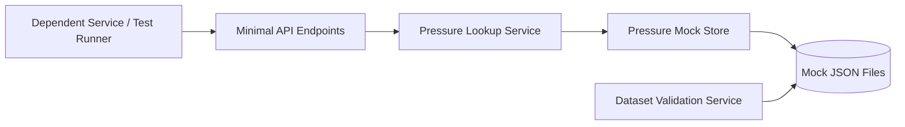
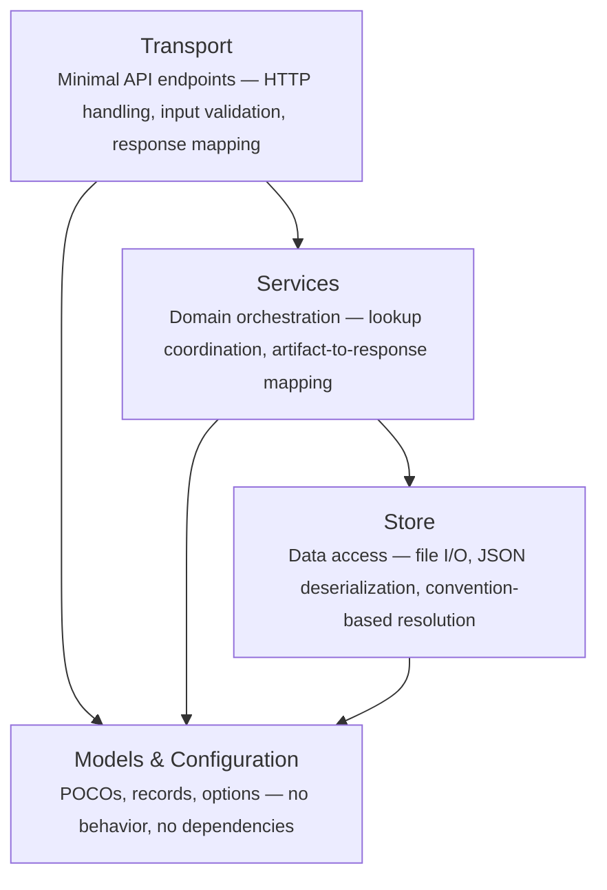
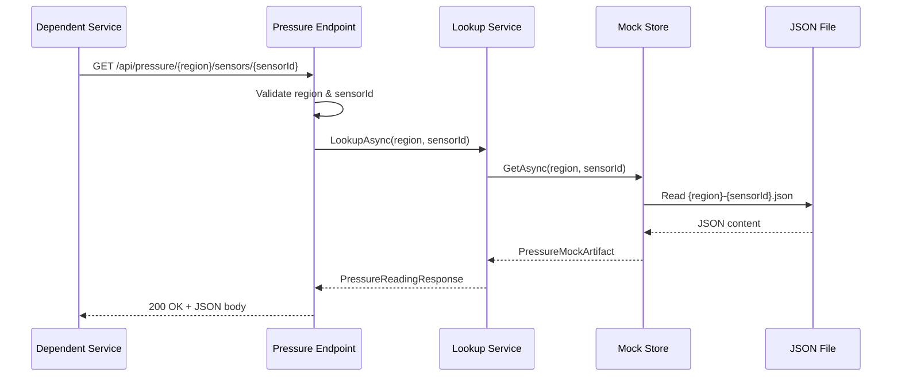

<!-- SPECIT -->
# Architecture — Pressure Sensor Service

> **Version**: 1.1 
> **Created**: 2026-04-15 
> **Last Updated**: 2026-04-15 
> **Owner**: Dave Harding 
> **Project**: Pressure Sensor 
> **Status**: Approved

---

> Pressure Sensor Service is a self-contained ASP.NET Core Minimal API that returns deterministic mock barometric pressure readings by region and sensor ID. It serves internal development teams building weather-report services that need a stable, shared pressure-data contract without relying on external pressure providers or hardware sensors. All responses are backed by a human-readable, file-based JSON mock dataset embedded in the project.

---

## Architecture Principles

1. **Separation of HTTP and domain** — Endpoint code must not contain business logic; endpoints validate inputs, delegate to services, and map responses. All domain logic lives in service implementations.
2. **Interface-driven dependencies** — All cross-boundary dependencies use interfaces defined at the consuming layer. Services depend on abstractions (`IPressureMockStore`, `IPressureLookupService`), never on concrete implementations directly.
3. **Fail loud at startup, fail clear at runtime** — The dataset validation hosted service blocks startup when mock data is missing or malformed. At runtime, lookup failures return RFC 7807 Problem Details with machine-readable error codes.
4. **Self-contained operation** — The service must run without external systems, network dependencies, or inter-service calls. All data comes from the embedded mock dataset on disk.
5. **Convention over configuration for mock resolution** — Mock files follow a deterministic `{region}-{sensorId}.json` naming convention that serves as the lookup key, eliminating the need for a registry or index.

---

## System Overview

Pressure Sensor Service is a single ASP.NET Core Minimal API process that reads pre-seeded JSON files from disk and returns barometric pressure data through HTTP endpoints. It has no database, no external service calls, and no inter-service dependencies. The Aspire AppHost registers it as a standalone project alongside sibling test services.

### Component Map

| Component | Responsibility | Technology |
|---|---|---|
| Minimal API Endpoints | HTTP request handling, input validation, response mapping, RFC 7807 error responses | ASP.NET Core Minimal API (.NET 10) |
| Pressure Lookup Service | Orchestrates mock data retrieval and maps artifacts to API response DTOs | C# scoped service |
| Pressure Mock Store | Reads and deserializes JSON mock files from disk by region and sensor ID | C# singleton service, `System.Text.Json` |
| Mock JSON Files | Deterministic source of pressure readings, one file per region-sensor combination | JSON files in `Mocks/` directory |
| Dataset Validation Service | Validates all mock files at startup for naming convention, deserializability, and content consistency | C# `IHostedService` |
| Diagnostics Endpoints | Health and readiness checks for operational verification | ASP.NET Core Minimal API |

---

## Layers & Boundaries

The codebase is organized into four conceptual layers. Each layer has a single responsibility and clear dependency rules.

**Dependency rules — these are hard constraints, not guidelines:**

- Dependencies flow downward only: Endpoints → Services → Store → Models
- Endpoints must not contain business logic — they validate HTTP inputs, delegate to service interfaces, and map results to HTTP responses
- Services must not reference `HttpContext`, `HttpRequest`, or any transport-layer type
- Store implementations must not import from Endpoints or Services
- All service dependencies use interfaces (`IPressureMockStore`, `IPressureLookupService`) — concrete implementations are registered in DI only in `Program.cs`
- Models and configuration POCOs have no dependencies on any other layer

---

## Key Architectural Decisions

- **Single Minimal API service** — keeps the system simple and self-contained with no inter-service coordination, matching the sibling TemperatureSensor pattern established in this repository. → [ADR-0001](./adr/ADR-0001-single-minimal-api-service.md)
- **File-backed JSON mock dataset** — provides deterministic, human-readable, inspectable test data without requiring a database or external store. → [ADR-0002](./adr/ADR-0002-file-backed-json-mock-dataset.md)
- **Self-contained development runtime** — eliminates external dependencies so the service operates independently in local and cloud development environments with zero infrastructure setup. → [ADR-0003](./adr/ADR-0003-self-contained-dev-runtime.md)

---

## Primary Data Flow

**Happy path: Pressure lookup by region and sensor ID**

1. Dependent service sends `GET /api/pressure/{region}/sensors/{sensorId}` to the Minimal API endpoint.
2. Endpoint validates `region` against the configured `SupportedRegions` list and `sensorId` against the `SensorIdPattern` regex.
3. Endpoint calls `IPressureLookupService.LookupAsync(region, sensorId)`.
4. Lookup service calls `IPressureMockStore.GetAsync(region, sensorId)`.
5. Mock store resolves the file path `{MockDataPath}/{region}-{sensorId}.json` and deserializes it to a `PressureMockArtifact`.
6. Lookup service maps the artifact to a `PressureReadingResponse` DTO.
7. Endpoint returns `200 OK` with the JSON response body containing region, sensor ID, pressure value, and pressure unit.

**Key error paths:**

- **Unsupported region**: Endpoint detects region is not in `SupportedRegions` and returns `400 Bad Request` with Problem Details (`error_code: unsupported_region`) before calling the lookup service.
- **Invalid sensor ID**: Endpoint detects sensor ID does not match `SensorIdPattern` regex and returns `400 Bad Request` with Problem Details (`error_code: invalid_sensor_id`).
- **Mock not found**: Mock store cannot find a JSON file for the region-sensor combination. Lookup service propagates the failure. Endpoint returns `404 Not Found` with Problem Details (`error_code: mock_not_found`).
- **Dataset unavailable**: Mock store encounters an I/O or deserialization error. Endpoint returns `500 Internal Server Error` with Problem Details (`error_code: dataset_unavailable`).

---

## External Dependencies

| Dependency | Purpose | Required? | Failure behavior |
|---|---|---|---|
| Local filesystem (Mocks directory) | Source of mock pressure JSON files | Yes | Readiness probe (`/readyz`) returns 503; lookup requests return 500 with `dataset_unavailable` error code |
| Aspire AppHost | Orchestrates the service alongside sibling test services in development | No | Service can run standalone via `dotnet run`; Aspire is a convenience, not a hard requirement |

---

## Configuration Reference

| Key | Default | Purpose |
|---|---|---|
| `PressureSensor:MockDataPath` | `Mocks` | Relative path to the directory containing mock JSON files |
| `PressureSensor:SupportedRegions` | `eus,wus2` | Comma-separated list of valid region identifiers for input validation |
| `PressureSensor:SensorIdPattern` | `^[A-Za-z0-9]{8}$` | Regex pattern that sensor IDs must match |
| `PressureSensor:ValidateDatasetOnStartup` | `true` | Whether the dataset validation hosted service runs at startup |
| `PressureSensor:EnableOpenApi` | `true` | Whether OpenAPI document generation and the `/openapi` endpoint are enabled |

Config is loaded in this order (later entries win):
1. `appsettings.json` — committed defaults
2. `appsettings.{Environment}.json` — environment overrides
3. Environment variables — runtime overrides

---

## Observability

- **Logging**: Structured logging via the built-in ASP.NET Core logging infrastructure. Level conventions: `Information` for successful lookups and startup events, `Warning` for recoverable issues (e.g., missing mock file for a valid request), `Error` for dataset validation failures and unhandled exceptions.
- **Metrics**: No custom metrics in v1. Standard ASP.NET Core request metrics are available via the framework.
- **Tracing**: No distributed tracing in v1. The service is self-contained with no downstream calls to trace.
- **Health endpoint**: `GET /healthz` returns `200 OK` with `{ "status": "healthy" }` unconditionally. `GET /readyz` checks that the `MockDataPath` directory exists and returns `200 OK` or `503 Service Unavailable` with error details.

---

## Infrastructure & Deployment

### Environments

| Environment | Purpose | URL / Access |
|---|---|---|
| Local (standalone) | Individual developer testing via `dotnet run` | `http://localhost:{port}` per `launchSettings.json` |
| Local (Aspire) | Multi-service development orchestration via Aspire AppHost | URL assigned by Aspire dashboard |

### Deployment Topology

Single-process ASP.NET Core application. No containers, no orchestration, no cloud deployment in v1. The service runs as a standalone process or as a project resource within the Aspire AppHost.

### CI/CD Pipeline

- **Build**: Standard `dotnet build` as part of the solution-level build
- **Test**: Unit tests run via `dotnet test` on the `PressureSensor.UnitTests` project
- **Deploy**: No deployment pipeline in v1 — this is a development-only service

---

## Non-Goals & Known Constraints

**This system will not:**

- **Serve production traffic** — it is explicitly scoped to local and cloud development environments. Production-grade concerns (scaling, SLAs, auth, rate limiting) are intentionally excluded.
- **Connect to real pressure providers or hardware** — all data comes from the embedded mock dataset. Live sensor integration is out of scope for all planned versions.
- **Provide forecasting, trend analysis, or historical pressure series** — the service returns current mock values only. Time-series capabilities are not planned.
- **Implement authentication or authorization** — the service is internal-only and does not handle sensitive data. Security controls are deferred to a future version if the service scope expands.

**Known limitations and accepted tradeoffs:**

- **Fixed mock dataset** — the seeded dataset is static and must be updated manually to add new region-sensor combinations. This is accepted because determinism and inspectability are more valuable than dynamic data generation for the intended test use case.
- **No persistence or state** — the service reads from disk on every request. There is no caching layer. This is accepted because sub-millisecond file reads on local disk meet the performance target and caching would add complexity with no benefit for the expected request volume.
- **Single-process, no horizontal scaling** — the service is not designed to run behind a load balancer or scale out. This is accepted because it serves a small number of development consumers, not production traffic.

---

## Decision Log

| ADR | Title |
|---|---|
| [ADR-0001](./adr/ADR-0001-single-minimal-api-service.md) | Single Minimal API Service |
| [ADR-0002](./adr/ADR-0002-file-backed-json-mock-dataset.md) | File-Backed JSON Mock Dataset |
| [ADR-0003](./adr/ADR-0003-self-contained-dev-runtime.md) | Self-Contained Development Runtime |

---

## Related Documents

- [`PRD.md`](./PRD.md) — product requirements and feature scope
- [`adr/`](./adr/) — full decision records

---

## Appendices

### Glossary

| Term | Definition |
|---|---|
| Barometric pressure | Atmospheric pressure measurement, expressed as a numeric value with a unit (e.g., hPa, mbar), returned by the service for a supported region-sensor combination |
| Sensor ID | Eight-character alphanumeric identifier used by callers to request pressure data for a specific pressure sensor |
| Region | Short string identifier (e.g., `eus`, `wus2`) representing a geographic area for which mock pressure data is available |
| Mock artifact | A single JSON file in the `Mocks/` directory that contains the seeded pressure reading for one region-sensor combination |
| Problem Details | RFC 7807 standard JSON error response format used for all client and server error responses |

### External References

- [ASP.NET Core Minimal APIs](https://learn.microsoft.com/en-us/aspnet/core/fundamentals/minimal-apis) — framework documentation for the API layer
- [RFC 7807 — Problem Details for HTTP APIs](https://datatracker.ietf.org/doc/html/rfc7807) — error response format standard used by all endpoints
- [.NET Aspire](https://learn.microsoft.com/en-us/dotnet/aspire/) — development orchestration framework used by the AppHost
