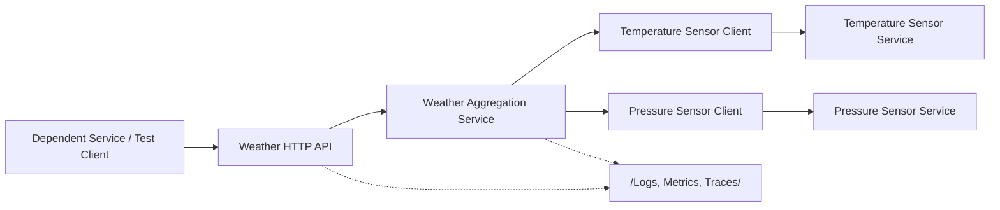
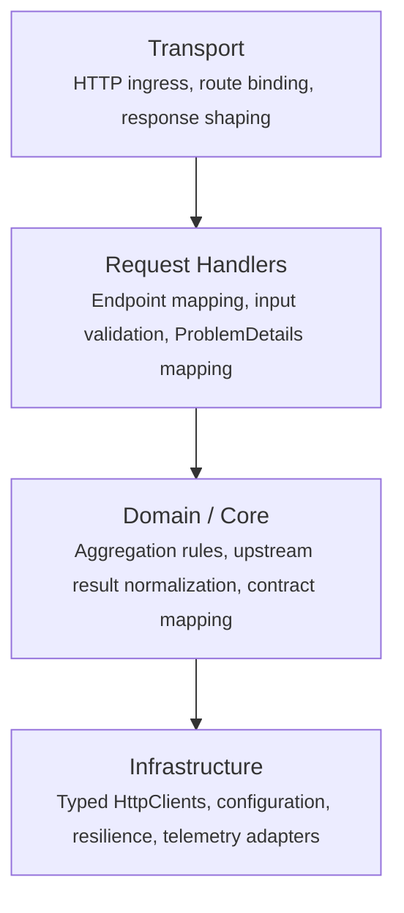
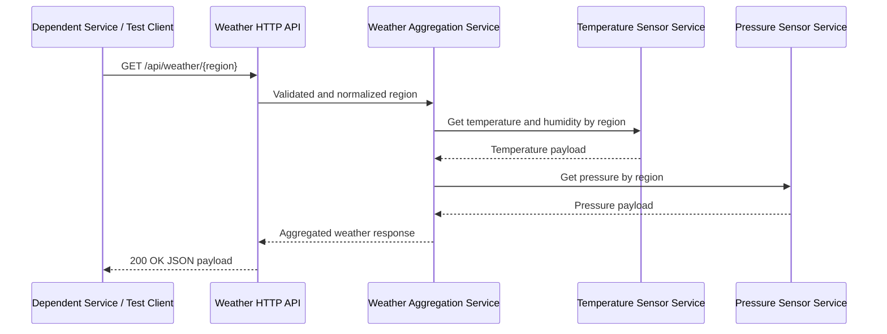
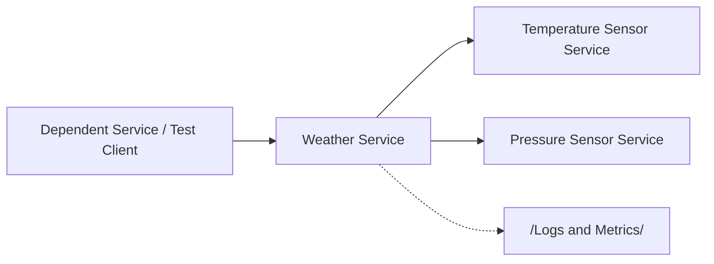

<!-- SPARK -->

# Architecture - Weather Service

> **Version**: 1.1 
> **Created**: 2026-04-20 
> **Last Updated**: 2026-04-25 
> **Owner**: Dave Harding 
> **Namespace**: Test 
> **Project**: Weather 
> **Project Type**: dotnet-webapi 
> **Status**: Draft
> **Type**: Architecture 

---

> Weather Service is a development-time weather aggregation API for internal services and test automation running on local workstations or cloud dev environments. It returns one regional weather response by composing deterministic temperature, humidity, and pressure readings from sibling upstream test services behind a single stable contract. The architecture stays intentionally small: one HTTP endpoint validates region input, calls the required upstream services through typed HTTP clients, and fails clearly when any required upstream input is unavailable or invalid.

---

## Architecture Principles

1. **Aggregation stays at one boundary** - callers should make one HTTP request to Weather Service and never coordinate Temperature Sensor and Pressure Sensor calls directly in v1.
2. **No partial success for required data** - the service returns success only when temperature, humidity, and pressure are all available and valid for the requested region.
3. **Explicit upstream boundaries** - integration with sibling services happens through typed HTTP clients and versioned response contracts rather than shared files, shared databases, or in-process coupling.
4. **Repository-aligned minimal hosting** - the service follows the repo's established Minimal API hosting pattern (chosen to match the sibling Temperature Sensor and Pressure Sensor projects that already use this style) so transport, orchestration, and infrastructure concerns remain easy to reason about and test.

---

## System Overview

At the time of this architecture pass, no Weather source project exists under the repository's `src/` tree. This document therefore defines the target implementation baseline for a new internal test service consistent with the sibling Temperature Sensor and Pressure Sensor services already documented in this repo. The service is expected to be implemented as a single ASP.NET Core Minimal API process that exposes one read-only weather lookup endpoint, validates a canonical region value, requests temperature and humidity from Temperature Sensor Service, requests pressure from Pressure Sensor Service, and maps the combined result into one caller-facing weather contract.

### Component Map

| Component | Responsibility | Technology |
|---|---|---|
| Weather HTTP API | Accepts `GET /api/weather/{region}`, validates route input, and shapes JSON success or error responses | C#, ASP.NET Core Minimal APIs |
| Weather aggregation service | Orchestrates upstream calls, enforces all-or-nothing success rules, and maps upstream responses to the public weather contract | C#, .NET service layer |
| Temperature Sensor client | Calls the sibling temperature service and normalizes temperature and humidity payloads for aggregation | Typed `HttpClient`, JSON serialization |
| Pressure Sensor client | Calls the sibling pressure service and normalizes pressure payloads for aggregation | Typed `HttpClient`, JSON serialization |
| Observability pipeline | Emits structured request logs, upstream dependency outcomes, and latency or failure telemetry | `ILogger`, OpenTelemetry-compatible metrics and tracing |

---

## Layers & Boundaries

The Weather service should follow the same boundary pattern used by sibling repo services even though its main capability is orchestration rather than local dataset lookup.

**Dependency rules - these are hard constraints, not guidelines:**

- Dependencies flow downward only: Transport -> Handlers -> Core -> Infrastructure.
- Core must not depend directly on ASP.NET Core transport types such as `HttpContext`, `HttpRequest`, or `IResult`.
- Endpoint code must not contain aggregation rules beyond request validation and service invocation.
- Infrastructure owns HTTP transport concerns, including base URLs, timeouts, retries if later added, and serialization of upstream contracts.
- No component may bypass the aggregation service to call sibling dependencies directly from the endpoint layer.
- The public weather contract must be mapped explicitly from upstream responses rather than inferred dynamically from arbitrary JSON.

---

## Key Architectural Decisions

- **Implement Weather as a single ASP.NET Core Minimal API aggregator** - this matches the repository's internal test-service pattern and keeps the orchestration surface small and testable. -> [ADR-0001](./adr/ADR-0001-single-minimal-api-aggregator.md)
- **Compose weather data through HTTP calls to sibling sensor services** - this preserves service boundaries and allows Weather to use the same contracts that consumers would exercise in integrated development flows. -> [ADR-0002](./adr/ADR-0002-http-based-aggregation-over-sibling-sensor-services.md)
- **Fail the whole weather lookup when any required upstream input is missing or invalid** - this protects consumers from ambiguous partial weather payloads and aligns with the PRD's no-partial-success requirement. -> [ADR-0003](./adr/ADR-0003-no-partial-success-for-required-weather-inputs.md)

---

## Primary Data Flow

The dominant flow is a caller requesting one aggregated weather payload for a supported region.

**Happy path: regional weather lookup**

1. A dependent service or test client sends `GET /api/weather/{region}` where `region` is a supported canonical region such as `eus` or `wus2`.
2. The HTTP endpoint validates and normalizes the region value, then creates an aggregation request.
3. The endpoint calls the weather aggregation service.
4. The aggregation service calls Temperature Sensor Service through the temperature client to retrieve the region's temperature and humidity data.
5. The aggregation service calls Pressure Sensor Service through the pressure client to retrieve the region's pressure data.
6. The aggregation service verifies that all required upstream fields are present and internally consistent for the same normalized region.
7. The aggregation service maps the combined values into the public weather response contract containing region, temperature, humidity, pressure, and unit fields.
8. The endpoint returns `200 OK` with the aggregated JSON payload and emits request and dependency telemetry.

**Key error paths:**

- **Unsupported region**: the HTTP endpoint rejects the request before any upstream call and returns `400 ProblemDetails` with a machine-readable validation code.
- **Temperature dependency failure**: the temperature client receives a timeout, invalid payload, or non-success response and the endpoint returns a dependency failure response instead of partial data.
- **Pressure dependency failure**: the pressure client receives a timeout, invalid payload, or non-success response and the endpoint returns a dependency failure response instead of partial data.
- **Region mismatch across upstream responses**: the aggregation service detects inconsistent canonical region data and returns `502 ProblemDetails` because the dependency set is internally inconsistent.

---

## External Dependencies

| Dependency | Purpose | Required? | Failure behavior |
|---|---|---|---|
| Temperature Sensor Service | Supplies deterministic temperature and humidity values for a supported region | Yes | Weather lookup returns dependency failure and does not emit a partial success response |
| Pressure Sensor Service | Supplies deterministic pressure values for a supported region | Yes | Weather lookup returns dependency failure and does not emit a partial success response |
| Development orchestration environment | Starts Weather beside its sibling services in local or cloud development flows | Optional | The service can run standalone, but integrated weather lookups fail until dependency base URLs resolve correctly |
| OpenTelemetry or log sink | Receives diagnostics when export is enabled | Optional | Request handling continues with local process logging if telemetry export is unavailable |

---

## Configuration Reference

| Key | Default | Purpose |
|---|---|---|
| `ASPNETCORE_URLS` | `http://0.0.0.0:8080` | HTTP listen address for local and containerized development runs |
| `Weather:SupportedRegions` | `eus,wus2` | Canonical list of region values accepted by the API |
| `Weather:TemperatureSensorBaseUrl` | `http://temperaturesensor` | Base URL for the sibling temperature dependency in composed dev environments |
| `Weather:PressureSensorBaseUrl` | `http://pressuresensor` | Base URL for the sibling pressure dependency in composed dev environments |
| `Weather:RequestTimeoutSeconds` | `2` | Timeout budget for upstream dependency calls during one aggregation request |
| `Weather:EnableOpenApi` | `true` | Enables OpenAPI metadata for internal development discoverability |

Config is loaded in this order (later entries win):
1. `appsettings.json` - committed defaults
2. `appsettings.Development.json` and other environment-specific override files - environment overrides
3. Environment variables - runtime overrides

---

## Security & Trust Boundary

- **Caller trust model**: Only internal services and test automation in local workstations or cloud dev environments are expected to call the API; no public internet exposure is part of the design.
- **Write / destructive operations**: None in v1 - the API is read-only and does not create, mutate, or delete upstream weather data.
- **Sensitive data handled**: The service handles deterministic mock weather data and internal dependency URLs only; no external cloud credentials or end-user identity data are required for v1 request fulfillment.
- **Protected resources**: Dependency configuration and the public weather contract must not be modified by requests; changes occur through repository or environment configuration under owner control.
- **Audit trail**: Structured logs record normalized region, dependency call outcomes, latency, validation failures, and dependency error classification for troubleshooting.

---

## Observability

- **Logging**: Structured application logs via the framework's built-in `ILogger` abstraction (used because it is the default logging contract in the host and requires no additional dependencies); `Information` for successful lookups and startup events, `Warning` for unsupported regions and upstream misses, and `Error` for invalid upstream contracts, timeouts, and unhandled exceptions.
- **Metrics**: Counters for weather lookup success, validation failure, temperature dependency failure, pressure dependency failure, and a request-duration histogram for endpoint latency.
- **Tracing**: Framework-provided request tracing with OpenTelemetry-compatible spans (chosen because sibling services already emit OpenTelemetry diagnostics, enabling correlated traces across the composed call chain) around the inbound request and each downstream HTTP dependency call.
- **Health endpoint**: `GET /healthz` verifies process liveness, and `GET /readyz` should verify that configuration is valid and both dependency base URLs are configured.

---

## Infrastructure & Deployment

### Environments

| Environment | Purpose | URL / Access |
|---|---|---|
| Local workstation | Supports developer debugging and local integration testing against deterministic sibling test services | Loopback URL such as `http://localhost:8080` or an assigned dev port |
| Cloud dev environment | Supports remote development sessions using the same sibling-service composition model | Internal dev URL or forwarded port scoped to the dev environment |

### Deployment Topology

The target deployment is a single host process running beside Temperature Sensor Service and Pressure Sensor Service in the repo's local or cloud-dev composition environment. Weather owns only HTTP aggregation logic; it does not store weather state or replicate upstream datasets. This keeps the service aligned with [ADR-0002](./adr/ADR-0002-http-based-aggregation-over-sibling-sensor-services.md) and preserves clear service boundaries.

### CI/CD Pipeline

- **Build**: Restore and build the Weather service and its tests with the repo's standard build workflow, following the approved single-host model in [ADR-0001](./adr/ADR-0001-single-minimal-api-aggregator.md).
- **Test**: Run unit tests for aggregation and error mapping plus integration tests that exercise composed calls against representative Temperature Sensor and Pressure Sensor responses.
- **Deploy**: Publish only to local and cloud development targets; no production deployment path is defined for v1.

---

## Non-Goals & Known Constraints

**This system will not:**

- Call live production weather providers or forecasting services - v1 is limited to deterministic internal development-time dependencies.
- Return partial weather payloads when only some upstream inputs are available - callers either receive a complete weather response or a clear failure.
- Support batch or historical weather queries - the API is intentionally limited to one current region lookup per request.
- Persist or mutate weather state - the service is an orchestrating read-only boundary only.

**Known limitations and accepted tradeoffs:**

- End-to-end lookup success depends on two sibling services being reachable and contract-compatible - this is accepted because the core product value is aggregated integration over those dependencies.
- HTTP-based composition introduces more network hops than an in-process shared data model - this is accepted to preserve realistic service boundaries and integration coverage.
- Supported region coverage is limited to the canonical region set shared by upstream dependencies - this is accepted to keep deterministic development scenarios simple and predictable in v1.

---

## Decision Log

| ADR | Title |
|---|---|
| [ADR-0001](./adr/ADR-0001-single-minimal-api-aggregator.md) | Implement Weather as a single ASP.NET Core Minimal API aggregator |
| [ADR-0002](./adr/ADR-0002-http-based-aggregation-over-sibling-sensor-services.md) | Compose weather data through HTTP calls to sibling sensor services |
| [ADR-0003](./adr/ADR-0003-no-partial-success-for-required-weather-inputs.md) | Fail whole weather lookups when required upstream inputs are missing or invalid |

---

## Related Documents

- [PRD.md](./PRD.md) - product requirements and feature scope
- [adr/](./adr/) - full decision records
- [../TemperatureSensor/ARCHITECTURE.md](../TemperatureSensor/ARCHITECTURE.md) - sibling service architecture for the temperature dependency
- [../PressureSensor/ARCHITECTURE.md](../PressureSensor/ARCHITECTURE.md) - sibling service architecture for the pressure dependency

---

## Appendices

### Glossary

| Term | Definition |
|---|---|
| Aggregated weather response | The single caller-facing payload containing region, temperature, humidity, pressure, and unit fields |
| Canonical region | The normalized region key accepted by Weather Service and expected to be supported consistently across required upstream dependencies |
| Dependency failure response | The error returned when one or more required upstream inputs cannot be retrieved, validated, or reconciled |
| Sibling sensor service | One of the repository's internal development-time services that provides weather-related source data to Weather Service |

### External References

- [ASP.NET Core Minimal APIs](https://learn.microsoft.com/aspnet/core/fundamentals/minimal-apis) - framework guidance for the target HTTP surface
- [IHttpClientFactory with .NET](https://learn.microsoft.com/dotnet/core/extensions/httpclient-factory) - recommended typed client pattern for upstream service composition
