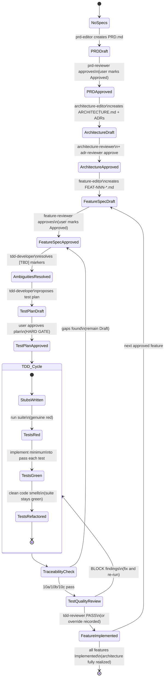

# Spark Workflow — State & Decision Diagrams

This document traces a single feature end-to-end through the Spark plugin's spec-driven workflow: from a brand-new repo with **no specs and no code** to a feature that is **fully implemented** with passing tests, traceable acceptance criteria, and required scaffolding in place. Each artifact (PRD, Architecture, ADRs, Feature spec, Test plan) has its own editor↔reviewer↔comments-editor cycle; for clarity those cycles are collapsed into a single "Approve / Reject" gate per artifact below.

The workflow is orchestrated by `plugins/spark/agents/spark.agent.md` according to the rules in `plugins/spark/instructions/spark.instructions.md`. Once one feature reaches `FeatureImplemented`, the loop restarts at `FeatureSpecDraft` for the next approved feature; the repo reaches **Architecture Fully Realized** only when every approved feature is `Implemented`.

---

## State Diagram — Single Feature Lifecycle

---

## Decision Diagram — Gates & Branches

```mermaid
flowchart TD
    Start([No specs, no code]) --> WritePRD["prd-editor: write PRD.md"]
    WritePRD --> PRDReview{"PRD review<br/>approved?"}
    PRDReview -- No --> WritePRD
    PRDReview -- Yes --> WriteArch["architecture-editor:<br/>write ARCHITECTURE.md + ADRs"]

    WriteArch --> ArchReview{"Architecture + ADRs<br/>approved?"}
    ArchReview -- No --> WriteArch
    ArchReview -- Yes --> WriteFeat["feature-editor:<br/>write FEAT-NNN spec"]

    WriteFeat --> FeatReview{"Feature spec<br/>approved?"}
    FeatReview -- No --> WriteFeat
    FeatReview -- Yes --> Ambig{"tdd-developer:<br/>any TBD or<br/>ambiguity?"}

    Ambig -- Yes --> ResolveAmbig["Resolve with user,<br/>update FEAT spec"]
    ResolveAmbig --> Ambig
    Ambig -- No --> ProposePlan["tdd-developer:<br/>propose test plan"]

    ProposePlan --> PlanApproved{"User approves<br/>test plan?<br/>HARD GATE"}
    PlanApproved -- No --> ProposePlan
    PlanApproved -- Yes --> WriteStubs["Write stubs +<br/>all planned tests"]

    WriteStubs --> RedCheck{"Genuine red?<br/>all new tests fail<br/>at assertions<br/>+ no regressions"}
    RedCheck -- "No - setup cascade<br/>or stub passes test" --> WriteStubs
    RedCheck -- Yes --> Implement["Implement minimum<br/>code per test;<br/>run suite each change"]

    Implement --> GreenCheck{"All planned tests pass<br/>+ no previously-passing<br/>test broken?"}
    GreenCheck -- "No - regression" --> Revert1["Revert change"]
    Revert1 --> Implement
    GreenCheck -- Yes --> Refactor["Clean code smells<br/>one at a time;<br/>run suite each change"]

    Refactor --> RefactorCheck{"Suite still green<br/>after refactor?"}
    RefactorCheck -- No --> RevertRefactor["Revert refactor;<br/>log as ADR candidate"]
    RevertRefactor --> Refactor
    RefactorCheck -- Yes --> Trace{"Traceability check<br/>every AC has test,<br/>count matches plan,<br/>scaffolding present?"}

    Trace -- "No - gaps" --> WriteFeat
    Trace -- Yes --> QualityGate{"tdd-reviewer gate<br/>no BLOCK findings?"}
    QualityGate -- "No - fix" --> Implement
    QualityGate -- "No - override" --> RecordOverride["Append justification to<br/>Implementation Overrides"]
    QualityGate -- Yes --> MarkImpl["Mark FEAT-NNN.md +<br/>testplan.md Implemented"]
    RecordOverride --> MarkImpl

    MarkImpl --> MoreFeats{"More approved<br/>features?"}
    MoreFeats -- Yes --> WriteFeat
    MoreFeats -- No --> Done([Architecture<br/>fully realized])
```

---

## Agent Responsibility Map

| Transition / Gate | Responsible Agent | File |
| --- | --- | --- |
| Orchestrates entire workflow | `spark` | `plugins/spark/agents/spark.agent.md` |
| Workflow rules & status semantics | (instructions) | `plugins/spark/instructions/spark.instructions.md` |
| Write/update PRD | `prd-editor` | `plugins/spark/agents/prd-editor.agent.md` |
| Review PRD | `prd-reviewer` | `plugins/spark/agents/prd-reviewer.agent.md` |
| Write/update Architecture + bootstrap ADRs | `architecture-editor` | `plugins/spark/agents/architecture-editor.agent.md` |
| Review Architecture | `architecture-reviewer` | `plugins/spark/agents/architecture-reviewer.agent.md` |
| Write/update individual ADR | `adr-editor` | `plugins/spark/agents/adr-editor.agent.md` |
| Review ADR | `adr-reviewer` | `plugins/spark/agents/adr-reviewer.agent.md` |
| Write/update Feature spec | `feature-editor` | `plugins/spark/agents/feature-editor.agent.md` |
| Review Feature spec | `feature-reviewer` | `plugins/spark/agents/feature-reviewer.agent.md` |
| Resolve `.comments.json` feedback on any artifact | `comments-editor` | `plugins/spark/agents/comments-editor.agent.md` |
| Ambiguity check, test plan, Red→Green→Refactor, traceability, mark Implemented | `tdd-developer` | `plugins/spark/agents/tdd-developer.agent.md` |
| Mandatory test-quality gate before `Implemented` (T01–T18, C01–C04, C06) | `tdd-reviewer` | `plugins/spark/agents/tdd-reviewer.agent.md` |
| Bootstrap repo instructions when missing | `dotnet-webapi-project` / `dotnet-blazor-project` | `plugins/spark/skills/...` |

---

## TDD Cycle Invariants — Red → Green → Refactor

The TDD sub-cycle inside `TDD_Cycle` enforces these rules; violating any of them sends the cycle back to a prior state:

- **Red phase.** Every planned test from the approved test plan must fail at its assertion (not at imports, syntax, or setup), no test passes against a stub, and every previously-passing test still passes. If a stub accidentally passes a test, the test or the stub is wrong — fix before proceeding.
- **Green phase.** Implement the minimum code to make one failing test pass, then run the full suite. If a previously-passing test breaks, **revert immediately** rather than patching forward. No production code is written without a failing test driving it.
- **Refactor phase.** Fix one code smell at a time and re-run the suite after every change. The test count must not change. If a refactor turns the suite red, revert completely and record the constraint as an ADR candidate (handed to `adr-editor` after the feature ships).
- **Traceability check.** Before flipping `FEAT-NNN.md` and `FEAT-NNN.testplan.md` to `Implemented`, verify that every AC has ≥1 passing test, that the test count equals the plan count, that every test and every implementation file carries an AC coverage-map header, and that any scaffolding required by ARCHITECTURE.md / ADRs / the feature spec (e.g. `{Namespace}.AppHost`, companion projects, Aspire topology) actually exists in the filesystem. Gaps keep the artifacts at `Draft` until resolved.
- **Test-quality gate.** Once traceability passes, `tdd-developer` invokes `tdd-reviewer` automatically. The reviewer emits a machine-readable summary with a `gate` field; it must return `PASS` (zero `BLOCK`-severity findings) for the feature to move to `FeatureImplemented`. `BLOCK` findings either force a fix (loop back through the relevant TDD steps) or are explicitly overridden with a written justification appended to the feature spec's `Implementation Overrides` section. `WARN` and `INFO` findings surface in the summary but do not block.

Once the last approved feature reaches `Implemented`, the architecture is fully realized and the workflow terminates.
