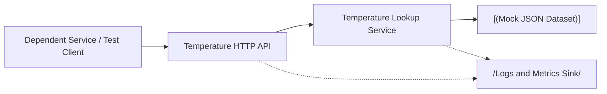
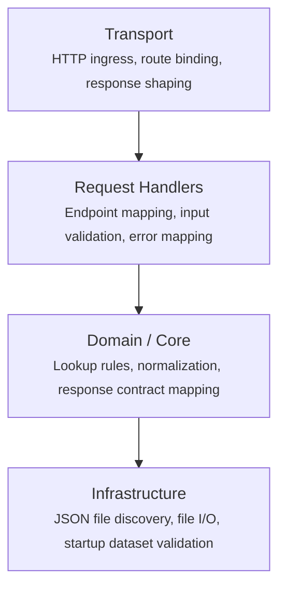
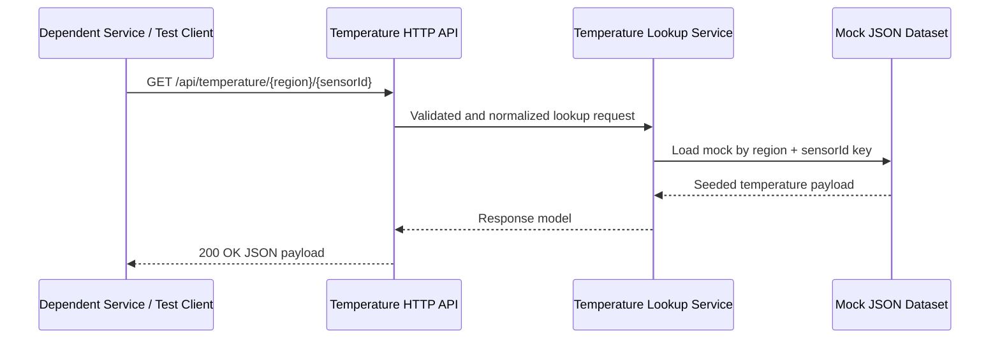
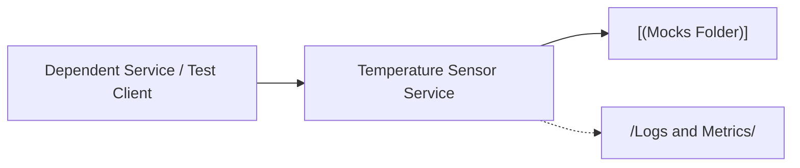

# Architecture - Temperature Sensor WebAPI Service

> **Version**: 1.0 
> **Created**: 2026-04-14 
> **Last Updated**: 2026-04-14 
> **Owner**: Dave Harding 
> **Project**: Temperature Sensor 
> **Status**: Approved

---

> Temperature Sensor WebAPI Service is a self-contained development-time HTTP API for internal services and test automation running on local workstations or cloud dev environments. It returns deterministic temperature and humidity payloads for supported regions and 8-character alphanumeric sensor IDs without calling any external sensor platform. The architecture is intentionally small: a single .NET 10 Minimal API reads curated JSON mocks from a local content root so callers get one stable contract and repeatable results.

---

## Architecture Principles

1. **Single boundary, small surface area** - the service stays a single Minimal API host so request handling, validation, and response shaping remain easy to reason about for a narrow test-only capability.
2. **Deterministic file-backed data over generated behavior** - responses come from curated JSON mock artifacts keyed by region and sensor ID so test runs remain reproducible and the dataset stays human-reviewable.
3. **No runtime network dependencies** - the service must satisfy requests without external HTTP calls, databases, or shared platforms so local and cloud dev workflows remain isolated and reliable.
4. **Explicit boundary validation** - region and sensor ID validation happens at the HTTP boundary so invalid inputs fail clearly and core lookup logic can operate on normalized values.

---

## System Overview

The service is a single ASP.NET Core Minimal API process that exposes one read-only HTTP endpoint for temperature lookup. Requests are validated and normalized at the endpoint layer, passed to a lookup service that maps the route values to a mock artifact file, and fulfilled from JSON content stored in a `Mocks` folder packaged with or mounted into the service. Because the service is test-only and self-contained, the runtime architecture avoids any external network calls and treats the mock dataset as the source of truth for successful responses.

### Component Map

| Component | Responsibility | Technology |
|---|---|---|
| Temperature HTTP API | Accepts `GET /api/temperature/{region}/{sensorId}`, validates route inputs, and shapes JSON success or error responses | C#, ASP.NET Core 10 Minimal APIs |
| Temperature lookup service | Normalizes the region and sensor ID, builds the dataset key, loads the matching mock artifact, and maps it to the public response contract | C#, .NET 10 service layer |
| Mock JSON dataset | Stores curated temperature response documents keyed by supported region and sensor ID in a human-readable format | JSON files in a `Mocks` content folder |
| Observability pipeline | Emits request logs, lookup outcomes, and readiness failures for local or cloud dev diagnostics | `ILogger`, OpenTelemetry-compatible metrics and tracing |

---

## Layers & Boundaries

The service follows the repository's Minimal API service pattern even though the runtime surface is intentionally small. HTTP concerns stay at the endpoint boundary, lookup rules stay in services, and file-system interaction stays behind an infrastructure-facing abstraction so the code remains easy to extend without mixing concerns.

**Dependency rules - these are hard constraints, not guidelines:**

- Dependencies flow downward only: Transport -> Handlers -> Core -> Infrastructure.
- Core must not read files directly - it depends on an interface that returns mock payloads by normalized lookup key.
- Endpoint code must not contain dataset lookup logic beyond request validation and service invocation.
- Infrastructure must not depend on ASP.NET Core HTTP abstractions such as `HttpContext`, `IResult`, or route types.
- No runtime component may call external HTTP services, databases, or queues in v1.
- Mock artifact shape and public API response shape must be versioned in code and validated explicitly rather than inferred dynamically at runtime.

---

## Key Architectural Decisions

- **Keep the service as a single ASP.NET Core Minimal API** - this matches the repo's test-service guidance and avoids splitting a narrow read-only capability across unnecessary components. -> [ADR-0001](./adr/ADR-0001-single-minimal-api-service.md)
- **Load responses from file-backed JSON mocks keyed by region and sensor ID** - this preserves deterministic behavior, makes the dataset inspectable, and rules out hidden generated or remote data sources. -> [ADR-0002](./adr/ADR-0002-file-backed-json-mock-dataset.md)
- **Restrict runtime to self-contained local and cloud dev environments with no external dependencies** - this protects the service's main goal of stable isolated testing and rules out live platform integrations in v1. -> [ADR-0003](./adr/ADR-0003-self-contained-dev-environment-runtime.md)

---

## Primary Data Flow

The dominant flow is a caller requesting a seeded temperature response for a supported region and sensor ID.

**Happy path: seeded temperature lookup**

1. A dependent service or test client sends `GET /api/temperature/{region}/{sensorId}` where `region` is `eus` or `wus2` and `sensorId` is an 8-character alphanumeric value.
2. The HTTP endpoint validates the route values, normalizes the region to the supported canonical form, and passes the normalized lookup request to the temperature lookup service.
3. The lookup service builds the dataset key from the normalized `region` and `sensorId` values and requests the matching mock artifact from the file-backed dataset provider.
4. The dataset provider resolves the JSON file in the `Mocks` folder, deserializes the stored payload, and returns the seeded temperature and humidity values.
5. The lookup service maps the mock artifact to the public response contract and returns it to the endpoint layer.
6. The endpoint returns a `200 OK` JSON response containing the sensor ID, region, temperature, and humidity fields.
7. Logging and metrics record the lookup result, route values, and outcome classification for local diagnostics.

**Key error paths:**

- **Invalid region or malformed sensor ID**: the HTTP endpoint rejects the request before lookup begins and returns `400 ProblemDetails` describing the validation failure.
- **Supported route but no matching mock artifact**: the lookup service reports a miss and the endpoint returns `404 ProblemDetails` so callers can distinguish bad input from missing test data.
- **Mock file missing, unreadable, or malformed JSON**: the dataset provider raises a configuration error, the endpoint returns `500 ProblemDetails`, and logs flag the dataset issue for the owning team.

---

## External Dependencies

| Dependency | Purpose | Required? | Failure behavior |
|---|---|---|---|
| `Mocks` JSON content folder | Source of deterministic seeded responses for successful lookups | Yes | The service fails readiness or returns `500` for lookups if the dataset path is missing, unreadable, or malformed |
| Local filesystem or mounted content volume | Hosts the packaged mock dataset in local and cloud dev environments | Yes | Requests cannot be fulfilled if the content root is unavailable; startup validation should fail fast where possible |
| OpenTelemetry or log sink | Receives structured logs, counters, and traces when diagnostics export is enabled | Optional | Lookup behavior continues with local process logging if export is unavailable |

---

## Configuration Reference

| Key | Default | Purpose |
|---|---|---|
| `ASPNETCORE_URLS` | `http://0.0.0.0:8080` | HTTP listen address for local and containerized development runs |
| `TemperatureSensor:MockDataPath` | `Mocks` | Relative or absolute path to the folder containing seeded JSON temperature responses |
| `TemperatureSensor:SupportedRegions` | `eus,wus2` | Canonical list of allowed region values accepted by the API |
| `TemperatureSensor:SensorIdPattern` | `^[A-Za-z0-9]{8}$` | Validation rule applied to route sensor IDs before lookup |
| `TemperatureSensor:ValidateDatasetOnStartup` | `true` | Controls whether the service validates mock dataset availability and JSON shape during startup |
| `TemperatureSensor:EnableOpenApi` | `true` | Enables OpenAPI metadata for local development discoverability |

Config is loaded in this order (later entries win):
1. `appsettings.json` - committed defaults
2. `appsettings.Development.json` and other environment-specific override files - environment overrides
3. Environment variables - runtime overrides

---

## Security & Trust Boundary

- **Caller trust model**: Only internal service callers and test automation in local workstations or cloud dev environments are expected to invoke the API; no public internet exposure is part of the design.
- **Write / destructive operations**: None in v1 - the API is read-only and does not create, mutate, or delete mock artifacts over HTTP.
- **Sensitive data handled**: The service returns only seeded mock temperature and humidity data; no live sensor credentials or external secrets are required for request fulfillment.
- **Protected resources**: The mock dataset and API contract must not be modified implicitly by requests; changes occur only through repository or mounted-content updates controlled by the owning team.
- **Audit trail**: Structured logs record request path, normalized region, sensor ID, validation failures, dataset misses, and dataset read errors for local troubleshooting.

---

## Observability

- **Logging**: Structured application logs via `ILogger`; `Information` for successful lookups, `Warning` for validation failures and dataset misses, and `Error` for unreadable or malformed mock artifacts.
- **Metrics**: Counters for lookup success, validation failure, dataset miss, and dataset read failure, plus a request-duration histogram for endpoint latency.
- **Tracing**: Standard ASP.NET Core request tracing with OpenTelemetry-compatible spans around HTTP request handling and dataset reads; no downstream network spans exist in v1.
- **Health endpoint**: `GET /healthz` verifies process liveness, and `GET /readyz` should verify that the configured mock dataset path is accessible and readable.

---

## Infrastructure & Deployment

### Environments

| Environment | Purpose | URL / Access |
|---|---|---|
| Local workstation | Supports developer debugging and local integration testing against deterministic temperature responses | Loopback URL such as `http://localhost:8080` or an assigned dev port |
| Cloud dev environment | Supports shared or remote development sessions without depending on a live sensor platform | Internal dev URL or forwarded port scoped to the dev environment |

### Deployment Topology

The service is deployed as a single ASP.NET Core process or container beside its seeded `Mocks` content. Callers issue HTTP requests directly to the service, which resolves the response from local packaged JSON data and emits diagnostics to the environment's configured log or telemetry pipeline.

### CI/CD Pipeline

- **Build**: Restore and build the .NET 10 service plus any test projects in pull requests and continuous integration.
- **Test**: Run unit and endpoint tests against a seeded mock dataset to verify route validation, lookup behavior, and response contract stability.
- **Deploy**: Publish only to local and cloud development targets using `dotnet run`, container tooling, or dev-host orchestration; no production deployment path is defined for v1.

---

## Non-Goals & Known Constraints

**This system will not:**

- Integrate with live sensor hardware or external telemetry platforms - v1 exists to remove those dependencies from development workflows.
- Persist or mutate temperature data through the API - mock data is curated outside the running service and served read-only at runtime.
- Provide historical trends, streaming updates, or analytics - the service returns only the current seeded response for a lookup key.

**Known limitations and accepted tradeoffs:**

- Lookup coverage is limited to the supported regions `eus` and `wus2` plus the seeded sensor IDs present in the mock dataset - this keeps behavior deterministic but requires explicit dataset maintenance.
- File-backed JSON storage is simple and inspectable, but malformed or missing artifacts can surface as configuration failures that require repository or content fixes rather than runtime recovery.
- The single-route API keeps the surface area easy to consume, but it couples lookup semantics to the route shape and leaves richer query models out of scope for v1.

---

## Decision Log

| ADR | Title |
|---|---|
| [ADR-0001](./adr/ADR-0001-single-minimal-api-service.md) | Keep Temperature Sensor Service as a single ASP.NET Core Minimal API |
| [ADR-0002](./adr/ADR-0002-file-backed-json-mock-dataset.md) | Use a file-backed JSON mock dataset keyed by region and sensor ID |
| [ADR-0003](./adr/ADR-0003-self-contained-dev-environment-runtime.md) | Restrict runtime to self-contained local and cloud dev environments |

---

## Related Documents

- [../../Mockery/AGENTS.md](../../Mockery/AGENTS.md) - shared .NET Web API service guidance currently used by sibling test services in this repo
- [PRD.md](./PRD.md) - product requirements and feature scope
- [adr/](./adr/) - full decision records

---

## Appendices

### Glossary

| Term | Definition |
|---|---|
| Mock dataset | The curated set of JSON files that seed deterministic temperature and humidity responses for supported lookup keys |
| Lookup key | The normalized pair of `region` and `sensorId` values used to resolve one mock artifact |
| Supported region | A canonical region code accepted by the API in v1, currently limited to `eus` and `wus2` |

### External References

- [ASP.NET Core Minimal APIs overview](https://learn.microsoft.com/aspnet/core/fundamentals/minimal-apis) - framework guidance for the intended HTTP surface and endpoint style
