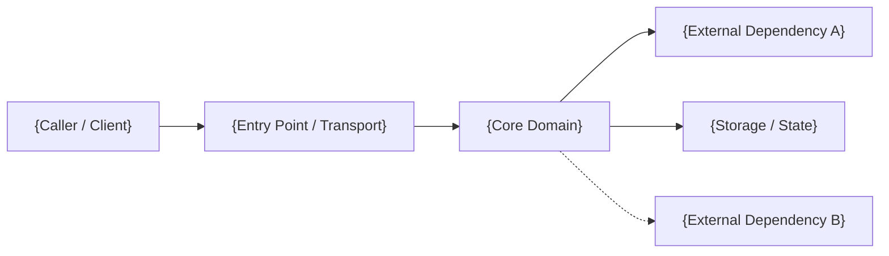
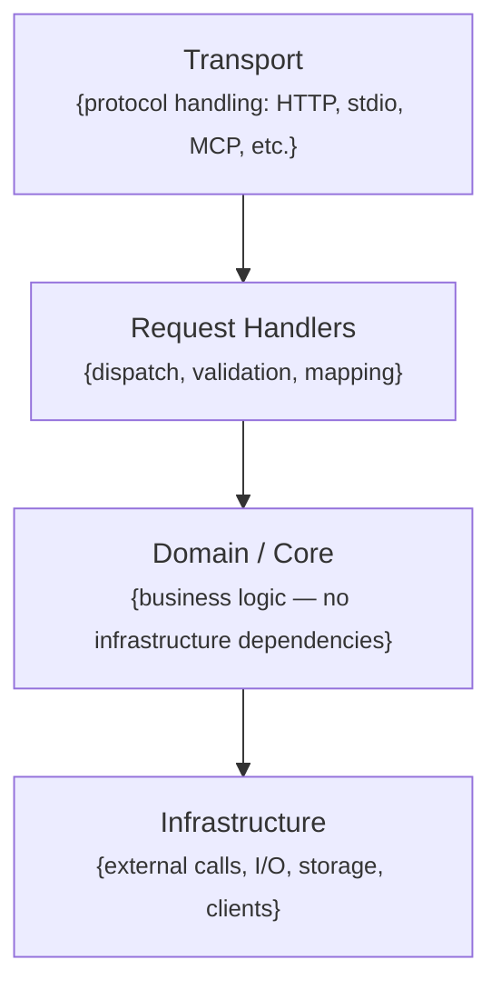
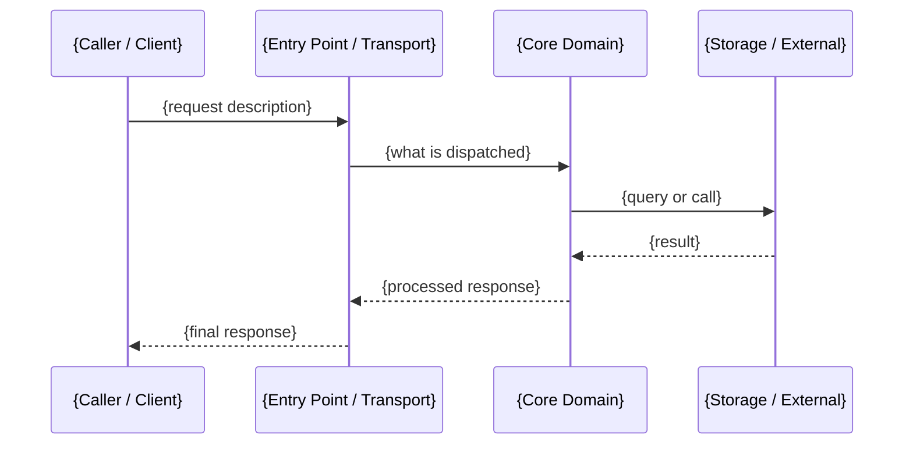

<!-- SPARK -->

# Architecture — {ProjectName}

> **Version**: {VERSION} 
> **Created**: {DATE} 
> **Last Updated**: {DATE} 
> **Owner**: {OWNER} 
> **Namespace**: {NAMESPACE} 
> **Project**: {PROJECT_NAME} 
> **Status**: Draft

---

> {One paragraph: what this system does, who uses it, and what problem it solves.
> This is the north star — every design decision below should make sense in light of this.}

---

## Architecture Principles

1. **{Principle Name}** — {One sentence explaining the principle and how it guides decisions.}
2. **{Principle Name}** — {One sentence explaining the principle and how it guides decisions.}
3. **{Principle Name}** — {One sentence explaining the principle and how it guides decisions.}

---

## System Overview

{2-3 sentences describing the system at the highest level of abstraction.
Answer: what are the major moving parts, and how do they relate to each other?
Avoid implementation detail — that belongs in the layers section.}

### Component Map

| Component | Responsibility | Technology |
|---|---|---|
| {Name} | {what it owns and does} | {language, framework, or protocol} |
| {Name} | {what it owns and does} | {language, framework, or protocol} |

---

## Layers & Boundaries

{Describe how the code is organized conceptually and what the rules are about
what can depend on what. This is the section AI agents need most when adding new code.}

**Dependency rules — these are hard constraints, not guidelines:**

- Dependencies flow downward only: Transport → Handlers → Core → Infrastructure
- Core must not reference Infrastructure directly — use interfaces defined in Core, implemented in Infrastructure
- {Any additional layer rules specific to this project}

---

## Key Architectural Decisions

{List the 3-5 decisions that most constrain how the system is built.
These are the things a contributor must understand before making significant changes.
Link to ADRs for full context. Keep each entry to one sentence of rationale.}

- **{Decision 1}** — {why this was chosen and what it rules out}. → [ADR-0001](./adr/ADR-0001.md)
- **{Decision 2}** — {why this was chosen and what it rules out}. → [ADR-0002](./adr/ADR-0002.md)
- **{Decision 3}** — {why this was chosen and what it rules out}. → [ADR-0003](./adr/ADR-0003.md)

---

## Primary Data Flow

{Walk through the most important request path end to end.
Use numbered steps. Be concrete about which component does what.
This lets agents know where to add logic for a new capability without tracing execution.}

**Happy path: {name the primary use case, e.g. "tool invocation via MCP"}**

**Key error paths:**

- **{Error condition A}**: {which component catches it, what is returned}
- **{Error condition B}**: {which component catches it, what is returned}

---

## External Dependencies

{Everything this system calls or relies on at runtime.
Include what it's used for, whether it's required or optional, and what happens when it's unavailable.}

| Dependency | Purpose | Required? | Failure behavior |
|---|---|---|---|
| {Name} | {why this exists} | Yes | {what happens if down or unreachable} |
| {Name} | {why this exists} | Optional | {graceful degradation path} |

---

## Configuration Reference

{All environment variables and config keys that change runtime behavior.
This saves agents from hunting through appsettings.json or guessing variable names.}

| Key | Default | Purpose |
|---|---|---|
| `{KEY_NAME}` | `{default value or "required"}` | {what behavior this controls} |
| `{KEY_NAME}` | `{default value or "required"}` | {what behavior this controls} |

Config is loaded in this order (later entries win):
1. `appsettings.json` — committed defaults
2. `appsettings.{Environment}.json` — environment overrides
3. Environment variables — runtime overrides

---

## Security & Trust Boundary

{Include this section for any system with write operations, external callers, or sensitive data.
Remove this section only for purely read-only, fully internal tools with no sensitive data.}

- **Caller trust model**: {who is allowed to call this, and how is that enforced}
- **Write / destructive operations**: {what can mutate or delete state, and what confirmation gates exist}
- **Sensitive data handled**: {what data flows through, how it's protected in transit and at rest}
- **Protected resources**: {what must never be modified without explicit confirmation — namespaces, accounts, etc.}
- **Audit trail**: {what operations are logged for auditability}

---

## Observability

- **Logging**: {format — e.g. structured JSON via Serilog. Level conventions: Info for operations, Warn for recoverable errors, Error for failures.}
- **Metrics**: {what is measured, where it is emitted — e.g. Prometheus, Azure Monitor}
- **Tracing**: {distributed tracing approach — e.g. OpenTelemetry with trace propagation via X-Request-ID}
- **Health endpoint**: {how to verify the system is alive and ready — e.g. GET /healthz}

---

## Infrastructure & Deployment

### Environments

| Environment | Purpose | URL / Access |
|---|---|---|
| {Name} | {what this environment is used for} | {how to access it} |

### Deployment Topology

{Describe how the system is deployed — container orchestration, serverless, VMs, etc.
Include a Mermaid diagram if the topology involves multiple services or zones.}

### CI/CD Pipeline

- **Build**: {what happens on commit/PR}
- **Test**: {what is tested automatically}
- **Deploy**: {how deployments are triggered and promoted between environments}

---

## Non-Goals & Known Constraints

{Explicitly stating what this system does NOT do is as important as what it does.
This section prevents scope creep and misguided "improvements" by agents and humans alike.}

**This system will not:**

- {Non-goal 1} — {why it is intentionally out of scope}
- {Non-goal 2} — {why it is intentionally out of scope}

**Known limitations and accepted tradeoffs:**

- {Limitation 1} — {the tradeoff that was accepted and why}
- {Limitation 2} — {the tradeoff that was accepted and why}

---

## Decision Log

| ADR | Title |
|---|---|
| [ADR-0001](./adr/ADR-0001-{slug}.md) | {title} |
| [ADR-0002](./adr/ADR-0002-{slug}.md) | {title} |
| [ADR-0003](./adr/ADR-0003-{slug}.md) | {title} |

---

## Related Documents

- [`PRD.md`](./PRD.md) — product requirements and feature scope
- [`adr/`](./adr/) — full decision records

---

## Appendices

### Glossary

| Term | Definition |
|---|---|
| {Term} | {Definition relevant to this architecture} |

### External References

- [{Reference Name}]({URL}) — {what it documents and why it's relevant}